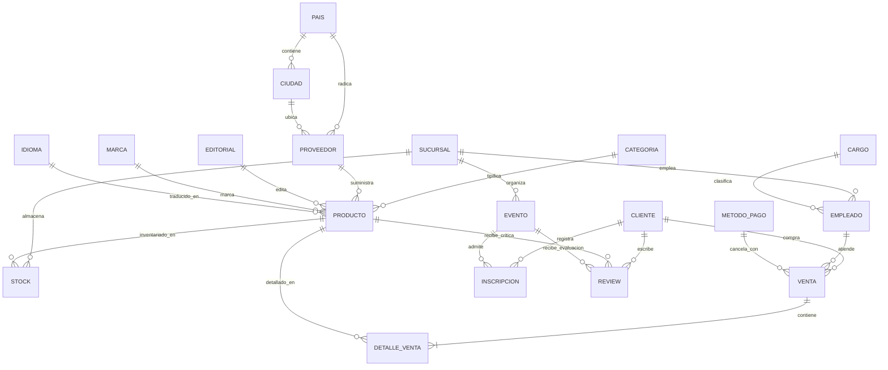

# Modelo y Esquema Relacional - Base de Datos Top 9

Este documento contiene la especificación completa del **Modelo Relacional** derivado del script [`creacion_tablas.sql`](file:///home/ruke/taller_base_de_datos/top_9/top_9/creacion_tablas.sql), preparado para ser trabajado, documentado y continuado en **Oracle SQL Developer Data Modeler**.

---

## 1. Esquema Relacional Notacional (Formato Tablas Relacionales)

A continuación se presenta la notación formal del modelo relacional.
- **PK**: Clave Primaria (en negrita y subrayado `__nombre__`).
- **FK**: Clave Foránea (marcada con asterisco `*` y cursiva `*nombre*`).

1. **SUCURSAL** (__id_sucursal__, nombre, direccion)
2. **CARGO** (__id_cargo__, nombre_cargo)
3. **IDIOMA** (__id_idioma__, nombre)
4. **PAIS** (__id_pais__, nombre_pais [UQ])
5. **CIUDAD** (__id_ciudad__, nombre_ciudad, *id_pais*)
   - *id_pais* referencia a **PAIS**(__id_pais__)
6. **CLIENTE** (__id_cliente__, primer_nombre, segundo_nombre, primer_apellido, segundo_apellido, rut, email, telefono, direccion)
7. **PROVEEDOR** (__id_proveedor__, nombre_proveedor, telefono, email, *id_pais*, *id_ciudad*, direccion)
   - *id_pais* referencia a **PAIS**(__id_pais__)
   - *id_ciudad* referencia a **CIUDAD**(__id_ciudad__)
8. **CATEGORIA** (__id_categoria__, nombre_categoria, descripcion)
9. **EDITORIAL** (__id_editorial__, nombre_editorial, telefono, email)
10. **MARCA** (__id_marca__, nombre_marca, telefono, email)
11. **METODO_PAGO** (__id_metodo_pago__, nombre)
12. **EVENTO** (__id_evento__, nombre_evento, tipo_evento, fecha_inicio, fecha_final, cupo_maximo, *id_sucursal*)
    - *id_sucursal* referencia a **SUCURSAL**(__id_sucursal__) [Opcional / NULL]
13. **EMPLEADO** (__id_empleado__, rut, primer_nombre, segundo_nombre, primer_apellido, segundo_apellido, sueldo, email, direccion, *id_cargo*, *id_sucursal*)
    - *id_cargo* referencia a **CARGO**(__id_cargo__)
    - *id_sucursal* referencia a **SUCURSAL**(__id_sucursal__)
14. **PRODUCTO** (__id_producto__, sku_producto, nombre_producto, min_jugadores, precio, *id_categoria*, *id_proveedor*, *id_editorial*, *id_marca*, *id_idioma*)
    - *id_categoria* referencia a **CATEGORIA**(__id_categoria__)
    - *id_proveedor* referencia a **PROVEEDOR**(__id_proveedor__)
    - *id_editorial* referencia a **EDITORIAL**(__id_editorial__) [Opcional / NULL]
    - *id_marca* referencia a **MARCA**(__id_marca__)
    - *id_idioma* referencia a **IDIOMA**(__id_idioma__)
15. **STOCK** (__id_stock__, *id_sucursal*, *id_producto*, cantidad_producto)
    - *id_sucursal* referencia a **SUCURSAL**(__id_sucursal__)
    - *id_producto* referencia a **PRODUCTO**(__id_producto__)
16. **VENTA** (__id_venta__, fecha_venta, total, nro_boleta, *id_cliente*, *id_empleado*, *id_metodo_pago*)
    - *id_cliente* referencia a **CLIENTE**(__id_cliente__)
    - *id_empleado* referencia a **EMPLEADO**(__id_empleado__)
    - *id_metodo_pago* referencia a **METODO_PAGO**(__id_metodo_pago__)
17. **DETALLE_VENTA** (__id_detalle__, cantidad, precio_unitario, *id_venta*, *id_producto*)
    - *id_venta* referencia a **VENTA**(__id_venta__)
    - *id_producto* referencia a **PRODUCTO**(__id_producto__)
18. **INSCRIPCION** (__id_inscripcion__, fecha_inscripcion, asistio, *id_cliente*, *id_evento*)
    - *id_cliente* referencia a **CLIENTE**(__id_cliente__)
    - *id_evento* referencia a **EVENTO**(__id_evento__)
19. **REVIEW** (__id_review__, descripcion, *id_cliente*, *id_producto*, *id_evento*)
    - *id_cliente* referencia a **CLIENTE**(__id_cliente__)
    - *id_producto* referencia a **PRODUCTO**(__id_producto__) [Opcional]
    - *id_evento* referencia a **EVENTO**(__id_evento__) [Opcional]
    - *Restricción de Arco (Exclusión)*: `(id_producto IS NOT NULL AND id_evento IS NULL) OR (id_producto IS NULL AND id_evento IS NOT NULL)`

---

## 2. Diccionario de Datos del Modelo Relacional (Tablas Detalladas)

### 2.1 Tablas Maestras e Independientes

#### Tabla: `SUCURSAL`
| Columna | Tipo de Dato | Nulidad | Clave | Referencia | Restricción / Observación |
| :--- | :--- | :---: | :---: | :--- | :--- |
| `id_sucursal` | NUMBER | NOT NULL | **PK** | - | `GENERATED ALWAYS AS IDENTITY` |
| `nombre` | VARCHAR2(50) | NOT NULL | - | - | Nombre de la sucursal (ej. Casa Matriz) |
| `direccion` | VARCHAR2(100) | NOT NULL | - | - | Dirección física |

#### Tabla: `CARGO`
| Columna | Tipo de Dato | Nulidad | Clave | Referencia | Restricción / Observación |
| :--- | :--- | :---: | :---: | :--- | :--- |
| `id_cargo` | NUMBER | NOT NULL | **PK** | - | `GENERATED ALWAYS AS IDENTITY` |
| `nombre_cargo` | VARCHAR2(50) | NOT NULL | - | - | Cargo laboral (ej. Cajero, Bodeguero, Gerente) |

#### Tabla: `IDIOMA`
| Columna | Tipo de Dato | Nulidad | Clave | Referencia | Restricción / Observación |
| :--- | :--- | :---: | :---: | :--- | :--- |
| `id_idioma` | NUMBER | NOT NULL | **PK** | - | `GENERATED ALWAYS AS IDENTITY` |
| `nombre` | VARCHAR2(50) | NOT NULL | - | - | Idioma del producto (Español, Inglés, etc.) |

#### Tabla: `PAIS`
| Columna | Tipo de Dato | Nulidad | Clave | Referencia | Restricción / Observación |
| :--- | :--- | :---: | :---: | :--- | :--- |
| `id_pais` | NUMBER | NOT NULL | **PK** | - | `GENERATED ALWAYS AS IDENTITY` |
| `nombre_pais` | VARCHAR2(100) | NOT NULL | **UQ** | - | `uq_nombre_pais` |

#### Tabla: `CIUDAD`
| Columna | Tipo de Dato | Nulidad | Clave | Referencia | Restricción / Observación |
| :--- | :--- | :---: | :---: | :--- | :--- |
| `id_ciudad` | NUMBER | NOT NULL | **PK** | - | `GENERATED ALWAYS AS IDENTITY` |
| `nombre_ciudad` | VARCHAR2(100) | NOT NULL | - | - | Nombre de la ciudad |
| `id_pais` | NUMBER | NOT NULL | **FK** | `PAIS(id_pais)` | `fk_ciudad_pais` |

#### Tabla: `CATEGORIA`
| Columna | Tipo de Dato | Nulidad | Clave | Referencia | Restricción / Observación |
| :--- | :--- | :---: | :---: | :--- | :--- |
| `id_categoria` | NUMBER | NOT NULL | **PK** | - | `GENERATED ALWAYS AS IDENTITY` |
| `nombre_categoria` | VARCHAR2(50) | NOT NULL | - | - | Naturaleza del producto (ej. Cartas, Juegos de mesa) |
| `descripcion` | VARCHAR2(255) | NOT NULL | - | - | Detalle de la categoría |

#### Tabla: `EDITORIAL`
| Columna | Tipo de Dato | Nulidad | Clave | Referencia | Restricción / Observación |
| :--- | :--- | :---: | :---: | :--- | :--- |
| `id_editorial` | NUMBER | NOT NULL | **PK** | - | `GENERATED ALWAYS AS IDENTITY` |
| `nombre_editorial` | VARCHAR2(100) | NOT NULL | - | - | Razón social de la editorial |
| `telefono` | VARCHAR2(15) | NULL | - | - | Teléfono de contacto |
| `email` | VARCHAR2(100) | NULL | - | - | Correo electrónico de contacto |

#### Tabla: `MARCA`
| Columna | Tipo de Dato | Nulidad | Clave | Referencia | Restricción / Observación |
| :--- | :--- | :---: | :---: | :--- | :--- |
| `id_marca` | NUMBER | NOT NULL | **PK** | - | `GENERATED ALWAYS AS IDENTITY` |
| `nombre_marca` | VARCHAR2(100) | NOT NULL | - | - | Marca comercial del producto |
| `telefono` | VARCHAR2(15) | NULL | - | - | Teléfono de contacto |
| `email` | VARCHAR2(100) | NULL | - | - | Correo electrónico de contacto |

#### Tabla: `METODO_PAGO`
| Columna | Tipo de Dato | Nulidad | Clave | Referencia | Restricción / Observación |
| :--- | :--- | :---: | :---: | :--- | :--- |
| `id_metodo_pago` | NUMBER | NOT NULL | **PK** | - | `GENERATED ALWAYS AS IDENTITY` |
| `nombre` | VARCHAR2(50) | NOT NULL | - | - | Forma de pago (Efectivo, Débito, Crédito, etc.) |

---

### 2.2 Tablas de Personas, Proveedores y Operaciones

#### Tabla: `CLIENTE`
| Columna | Tipo de Dato | Nulidad | Clave | Referencia | Restricción / Observación |
| :--- | :--- | :---: | :---: | :--- | :--- |
| `id_cliente` | NUMBER | NOT NULL | **PK** | - | `GENERATED ALWAYS AS IDENTITY` |
| `primer_nombre` | VARCHAR2(50) | NOT NULL | - | - | Primer nombre |
| `segundo_nombre` | VARCHAR2(50) | NULL | - | - | Segundo nombre opcional |
| `primer_apellido` | VARCHAR2(50) | NOT NULL | - | - | Primer apellido |
| `segundo_apellido` | VARCHAR2(50) | NULL | - | - | Segundo apellido opcional |
| `rut` | VARCHAR2(12) | NOT NULL | - | - | RUT / Identificación fiscal |
| `email` | VARCHAR2(100) | NULL | - | - | Correo electrónico |
| `telefono` | VARCHAR2(15) | NULL | - | - | Teléfono de contacto |
| `direccion` | VARCHAR2(150) | NULL | - | - | Dirección del cliente |

#### Tabla: `PROVEEDOR`
| Columna | Tipo de Dato | Nulidad | Clave | Referencia | Restricción / Observación |
| :--- | :--- | :---: | :---: | :--- | :--- |
| `id_proveedor` | NUMBER | NOT NULL | **PK** | - | `GENERATED ALWAYS AS IDENTITY` |
| `nombre_proveedor`| VARCHAR2(100) | NOT NULL | - | - | Razón social del proveedor |
| `telefono` | VARCHAR2(15) | NOT NULL | - | - | Teléfono de contacto |
| `email` | VARCHAR2(100) | NOT NULL | - | - | Correo corporativo |
| `id_pais` | NUMBER | NOT NULL | **FK** | `PAIS(id_pais)` | `fk_id_pais` |
| `id_ciudad` | NUMBER | NOT NULL | **FK** | `CIUDAD(id_ciudad)` | `fk_id_ciudad` |
| `direccion` | VARCHAR2(100) | NOT NULL | - | - | Dirección comercial |

#### Tabla: `EMPLEADO`
| Columna | Tipo de Dato | Nulidad | Clave | Referencia | Restricción / Observación |
| :--- | :--- | :---: | :---: | :--- | :--- |
| `id_empleado` | NUMBER | NOT NULL | **PK** | - | `GENERATED ALWAYS AS IDENTITY` |
| `rut` | VARCHAR2(12) | NOT NULL | - | - | RUT del trabajador |
| `primer_nombre` | VARCHAR2(50) | NOT NULL | - | - | Primer nombre |
| `segundo_nombre` | VARCHAR2(50) | NULL | - | - | Segundo nombre |
| `primer_apellido` | VARCHAR2(50) | NULL | - | - | Primer apellido |
| `segundo_apellido`| VARCHAR2(50) | NULL | - | - | Segundo apellido |
| `sueldo` | NUMBER | NOT NULL | - | - | Sueldo bruto |
| `email` | VARCHAR2(100) | NOT NULL | - | - | Email laboral |
| `direccion` | VARCHAR2(150) | NOT NULL | - | - | Dirección residencial |
| `id_cargo` | NUMBER | NOT NULL | **FK** | `CARGO(id_cargo)` | `fk_empleado_cargo` |
| `id_sucursal` | NUMBER | NOT NULL | **FK** | `SUCURSAL(id_sucursal)` | `fk_sucursal_empleado` |

---

### 2.3 Tablas de Catálogo, Inventario y Eventos

#### Tabla: `PRODUCTO`
| Columna | Tipo de Dato | Nulidad | Clave | Referencia | Restricción / Observación |
| :--- | :--- | :---: | :---: | :--- | :--- |
| `id_producto` | NUMBER | NOT NULL | **PK** | - | `GENERATED ALWAYS AS IDENTITY` |
| `sku_producto` | VARCHAR2(50) | NULL | - | - | Código SKU |
| `nombre_producto`| VARCHAR2(100) | NOT NULL | - | - | Nombre del artículo/juego |
| `min_jugadores` | NUMBER | NOT NULL | - | - | Mínimo de jugadores |
| `precio` | NUMBER | NOT NULL | - | - | Precio de venta |
| `id_categoria` | NUMBER | NOT NULL | **FK** | `CATEGORIA(id_categoria)` | `fk_prod_categoria` |
| `id_proveedor` | NUMBER | NOT NULL | **FK** | `PROVEEDOR(id_proveedor)` | `fk_prod_proveedor` |
| `id_editorial` | NUMBER | NULL | **FK** | `EDITORIAL(id_editorial)` | `fk_prod_editorial` |
| `id_marca` | NUMBER | NOT NULL | **FK** | `MARCA(id_marca)` | `fk_prod_marca` |
| `id_idioma` | NUMBER | NOT NULL | **FK** | `IDIOMA(id_idioma)` | `fk_idioma_producto` |

#### Tabla: `STOCK`
| Columna | Tipo de Dato | Nulidad | Clave | Referencia | Restricción / Observación |
| :--- | :--- | :---: | :---: | :--- | :--- |
| `id_stock` | NUMBER | NOT NULL | **PK** | - | `GENERATED ALWAYS AS IDENTITY` |
| `id_sucursal` | NUMBER | NOT NULL | **FK** | `SUCURSAL(id_sucursal)` | `fk_stock_sucursal` |
| `id_producto` | NUMBER | NOT NULL | **FK** | `PRODUCTO(id_producto)` | `fk_stock_producto` |
| `cantidad_producto`| NUMBER | NOT NULL | - | - | Existencias disponibles en sucursal |

#### Tabla: `EVENTO`
| Columna | Tipo de Dato | Nulidad | Clave | Referencia | Restricción / Observación |
| :--- | :--- | :---: | :---: | :--- | :--- |
| `id_evento` | NUMBER | NOT NULL | **PK** | - | `GENERATED ALWAYS AS IDENTITY` |
| `nombre_evento` | VARCHAR2(100) | NOT NULL | - | - | Nombre de la actividad o torneo |
| `tipo_evento` | VARCHAR2(50) | NOT NULL | - | - | Torneo, lanzamiento, demostración |
| `fecha_inicio` | DATE | NOT NULL | - | - | Fecha y hora de inicio |
| `fecha_final` | DATE | NOT NULL | - | - | Fecha y hora de término |
| `cupo_maximo` | NUMBER | NOT NULL | - | - | Límite de participantes |
| `id_sucursal` | NUMBER | NULL | **FK** | `SUCURSAL(id_sucursal)` | `fk_sucursal_evento` (Opcional) |

#### Tabla: `INSCRIPCION`
| Columna | Tipo de Dato | Nulidad | Clave | Referencia | Restricción / Observación |
| :--- | :--- | :---: | :---: | :--- | :--- |
| `id_inscripcion`| NUMBER | NOT NULL | **PK** | - | `GENERATED ALWAYS AS IDENTITY` |
| `fecha_inscripcion`| DATE | NOT NULL | - | - | Momento de la inscripción |
| `asistio` | CHAR(1) | NOT NULL | - | - | Indicador de asistencia ('S' / 'N') |
| `id_cliente` | NUMBER | NOT NULL | **FK** | `CLIENTE(id_cliente)` | `fk_inscripcion_cliente` |
| `id_evento` | NUMBER | NOT NULL | **FK** | `EVENTO(id_evento)` | `fk_inscripcion_evento` |

---

### 2.4 Tablas Transaccionales y de Interacción

#### Tabla: `VENTA`
| Columna | Tipo de Dato | Nulidad | Clave | Referencia | Restricción / Observación |
| :--- | :--- | :---: | :---: | :--- | :--- |
| `id_venta` | NUMBER | NOT NULL | **PK** | - | `GENERATED ALWAYS AS IDENTITY` |
| `fecha_venta` | DATE | NOT NULL | - | - | Fecha de la transacción |
| `total` | NUMBER | NOT NULL | - | - | Monto total de la venta |
| `nro_boleta` | VARCHAR2(20) | NULL | - | - | Folio / número de boleta |
| `id_cliente` | NUMBER | NOT NULL | **FK** | `CLIENTE(id_cliente)` | `fk_venta_cliente` |
| `id_empleado` | NUMBER | NOT NULL | **FK** | `EMPLEADO(id_empleado)` | `fk_venta_empleado` |
| `id_metodo_pago`| NUMBER | NOT NULL | **FK** | `METODO_PAGO(id_metodo_pago)`| `fk_venta_metodo` |

#### Tabla: `DETALLE_VENTA`
| Columna | Tipo de Dato | Nulidad | Clave | Referencia | Restricción / Observación |
| :--- | :--- | :---: | :---: | :--- | :--- |
| `id_detalle` | NUMBER | NOT NULL | **PK** | - | `GENERATED ALWAYS AS IDENTITY` |
| `cantidad` | NUMBER | NOT NULL | - | - | Unidades compradas |
| `precio_unitario`| NUMBER | NOT NULL | - | - | Precio cobrado por unidad |
| `id_venta` | NUMBER | NOT NULL | **FK** | `VENTA(id_venta)` | `fk_detalle_venta` |
| `id_producto` | NUMBER | NOT NULL | **FK** | `PRODUCTO(id_producto)` | `fk_detalle_producto` |

#### Tabla: `REVIEW`
| Columna | Tipo de Dato | Nulidad | Clave | Referencia | Restricción / Observación |
| :--- | :--- | :---: | :---: | :--- | :--- |
| `id_review` | NUMBER | NOT NULL | **PK** | - | `GENERATED ALWAYS AS IDENTITY` |
| `descripcion` | VARCHAR2(500) | NOT NULL | - | - | Comentario u opinión |
| `id_cliente` | NUMBER | NOT NULL | **FK** | `CLIENTE(id_cliente)` | `fk_review_cliente` |
| `id_producto` | NUMBER | NULL | **FK** | `PRODUCTO(id_producto)` | `fk_review_producto` |
| `id_evento` | NUMBER | NULL | **FK** | `EVENTO(id_evento)` | `fk_review_evento` |
| *Restricción* | - | - | **CHECK** | - | `chk_review_objetivo`: Reseña exclusiva a Producto O a Evento |

---

## 3. Matriz de Relaciones y Cardinalidades

| Tabla Padre (1) | Cardinalidad | Tabla Hija (N) | Clave Foránea (FK) | Regla del Negocio |
| :--- | :---: | :--- | :--- | :--- |
| `PAIS` | 1 : N | `CIUDAD` | `CIUDAD.id_pais` | Un país agrupa múltiples ciudades. |
| `PAIS` | 1 : N | `PROVEEDOR` | `PROVEEDOR.id_pais` | Un país puede tener varios proveedores asociados. |
| `CIUDAD` | 1 : N | `PROVEEDOR` | `PROVEEDOR.id_ciudad` | Una ciudad tiene uno o más proveedores. |
| `SUCURSAL` | 1 : N | `EMPLEADO` | `EMPLEADO.id_sucursal` | Una sucursal tiene contratados múltiples empleados. |
| `CARGO` | 1 : N | `EMPLEADO` | `EMPLEADO.id_cargo` | Un cargo puede ser ejercido por varios empleados. |
| `SUCURSAL` | 0..1 : N | `EVENTO` | `EVENTO.id_sucursal` | Ciertos eventos se organizan en una sucursal física. |
| `CATEGORIA` | 1 : N | `PRODUCTO` | `PRODUCTO.id_categoria` | Una categoría clasifica muchos productos. |
| `PROVEEDOR` | 1 : N | `PRODUCTO` | `PRODUCTO.id_proveedor` | Un proveedor abastece una variedad de productos. |
| `EDITORIAL` | 0..1 : N | `PRODUCTO` | `PRODUCTO.id_editorial` | Una editorial publica ciertos productos (juegos/libros). |
| `MARCA` | 1 : N | `PRODUCTO` | `PRODUCTO.id_marca` | Una marca abarca varios artículos. |
| `IDIOMA` | 1 : N | `PRODUCTO` | `PRODUCTO.id_idioma` | Un idioma aplica a diversos productos de la tienda. |
| `SUCURSAL` | 1 : N | `STOCK` | `STOCK.id_sucursal` | Una sucursal mantiene existencias de múltiples productos. |
| `PRODUCTO` | 1 : N | `STOCK` | `STOCK.id_producto` | Un producto se almacena en distintas sucursales. |
| `CLIENTE` | 1 : N | `VENTA` | `VENTA.id_cliente` | Un cliente puede registrar múltiples compras. |
| `EMPLEADO` | 1 : N | `VENTA` | `VENTA.id_empleado` | Un empleado realiza múltiples ventas en caja. |
| `METODO_PAGO`| 1 : N | `VENTA` | `VENTA.id_metodo_pago`| Un medio de pago se utiliza en muchas ventas. |
| `VENTA` | 1 : N | `DETALLE_VENTA`| `DETALLE_VENTA.id_venta`| Una venta se compone de múltiples líneas de detalle. |
| `PRODUCTO` | 1 : N | `DETALLE_VENTA`| `DETALLE_VENTA.id_producto`| Un producto puede venderse en diferentes boletas. |
| `CLIENTE` | 1 : N | `INSCRIPCION` | `INSCRIPCION.id_cliente`| Un cliente se inscribe a diversos eventos. |
| `EVENTO` | 1 : N | `INSCRIPCION` | `INSCRIPCION.id_evento`| Un evento recibe la inscripción de múltiples clientes. |
| `CLIENTE` | 1 : N | `REVIEW` | `REVIEW.id_cliente` | Un cliente redacta diversas reseñas. |
| `PRODUCTO` | 0..1 : N | `REVIEW` | `REVIEW.id_producto` | Un producto puede recibir comentarios de clientes. |
| `EVENTO` | 0..1 : N | `REVIEW` | `REVIEW.id_evento` | Un evento puede recibir comentarios de asistentes. |

---

## 4. Diagrama Entidad-Relación / Modelo Relacional

---

## 5. Instrucciones para Continuar en Oracle SQL Developer Data Modeler

Existen dos vías directas para abrir y continuar trabajando este modelo en **Oracle SQL Developer Data Modeler**:

### Opción 1: Abrir el proyecto existente en el repositorio (`diseñorelacional.dmd`)
El repositorio ya posee un proyecto Data Modeler configurado con estas 19 tablas:
1. Abre **Oracle SQL Developer Data Modeler**.
2. Ve a **Archivo (File) > Abrir (Open)**.
3. Navega a la carpeta del proyecto y selecciona el archivo [`diseñorelacional.dmd`](file:///home/ruke/taller_base_de_datos/top_9/top_9/diseñorelacional.dmd).
4. En el panel izquierdo de **Explorador / Navegador**:
   - Expande **Modelos Relacionales (Relational Models)**.
   - Haz doble clic sobre **Relational_1**.
   - Verás el diagrama relacional completo con todas las tablas y claves foráneas.
5. **Para convertir o sincronizar con el Modelo Lógico**:
   - En la barra de herramientas, haz clic en el botón **Ingeniería a Modelo Lógico** (o presiona `Ctrl + Shift + L` / clic derecho en el diagrama relacional > *Ingeniería a Modelo Lógico*).
   - Se abrirá la ventana de mapeo donde puedes aceptar para sincronizar el Modelo Lógico y continuar editándolo conceptualmente.

### Opción 2: Importar un nuevo modelo desde el script SQL (`creacion_tablas.sql`)
Si deseas recrear o importar un modelo relacional limpio desde cero:
1. En Data Modeler, crea un diseño nuevo: **Archivo > Nuevo > Diseño**.
2. Ve a **Archivo > Importar > Archivo DDL (File > Import > DDL File)**.
3. En la lista de motores RDBMS, selecciona **Oracle Database 12c / 19c / 21c**.
4. Haz clic en **Agregar (Add)** y selecciona el archivo [`creacion_tablas.sql`](file:///home/ruke/taller_base_de_datos/top_9/top_9/creacion_tablas.sql).
5. Haz clic en **Aceptar / Generar**. Data Modeler procesará las instrucciones `CREATE TABLE`, `PRIMARY KEY`, `FOREIGN KEY` y `CHECK` y generará automáticamente el diagrama relacional completo.
